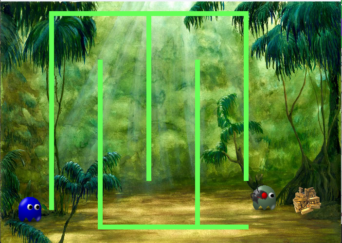

# Лабиринт

## План работы:

1. Подключил игровую библиотеку pygame.
2. Создал окно игры размером 700x500, дай ему название.
3. Создал игровой цикл с выходом при нажатии на «Закрыть окно».
4. Задал FPS 60 кадров/сек.
5. Установил фоновую музыку.
6. Создал и отобразил спрайты для игрока и врага.
7. Создал класс-наследник Player для главного героя (суперкласс — GameSprite). Данный тип спрайта должен управляться пользователем с помощью стрелок клавиатуры.
8. Создал класс-наследник Enemy для врага (суперкласс — GameSprite). Данный спрайт должен перемещаться по игровому пространству автоматически (например, влево-вправо, охраняя сокровище).
9. Создал класс Wall (наследник от класса Sprite библиотеки pygame) для спрайтов-препятствий. Создай минимум три экземпляра данного класса. Расположи препятствия в игровом пространстве.
10. Создал объекты класса Font для надписей “YOU WIN!” и “YOU LOSE!”.
11. Задал условия победы и проигрыша:
	- если главный герой коснулся сокровища — вывести надпись “YOU WIN!” и воспроизвести звук звона монет.
	- если главный герой коснулся стен лабиринта или врага — вывести надпись “ YOU LOSE!” и воспроизвести звук удара.

## Результат

